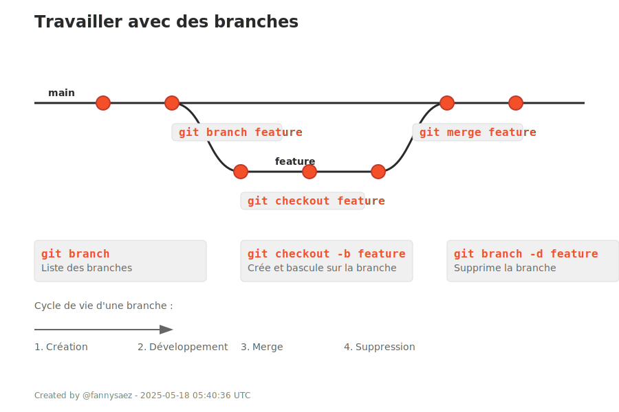

## 3. Travailler avec des branches

| Commande | Description |
|----------|-------------|
| `git branch` | Affiche la liste des branches existantes. |
| `git branch nom_branche` | Crée une nouvelle branche. |
| `git checkout nom_branche` | Change de branche. |
| `git checkout -b nom_branche` | Crée une branche ET bascule dessus directement. |
| `git merge nom_branche` | Fusionne une branche dans celle en cours. |
| `git branch -d nom_branche` | Supprime une branche locale. |

---

  

  <h3>Branche Git</h3>  
  

  <h3>Merge Git</h3>  
  

---

<a href="./changements.md">Précédent</a> 
| <a href="./depot-distant.md">Suivant</a>

