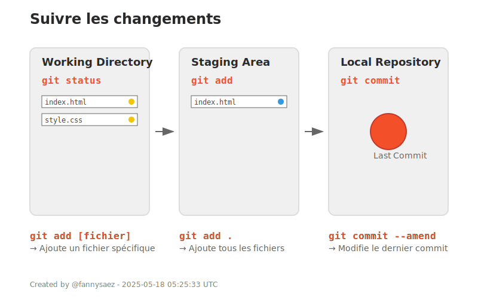

## 2. Suivre les changements

| Commande | Description |
|----------|-------------|
| `git status` | Affiche les fichiers modifiés, ajoutés ou supprimés. |
| `git add [fichier]` | Prépare un fichier pour le commit (le place dans la "staging area"). |
| `git add .` | Ajoute tous les fichiers modifiés à la staging area. |
| `git commit -m "Message"` | Enregistre officiellement les modifications avec un message descriptif. |
| `git commit --amend` | Modifie le dernier commit (pour corriger un oubli ou un message). |

---

  

---

<a href="./demarrer-Git.md">Précédent</a> 
| <a href="./">Suivant</a>

