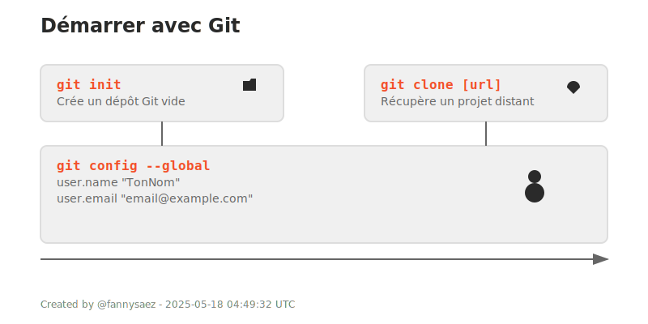

## 1. Démarrer avec Git

| Commande | Description |
|----------|-------------|
| `git init` | Crée un dépôt Git vide dans le dossier actuel (pour commencer à versionner un projet). |
| `git clone [url]` | Récupère un projet depuis un dépôt en ligne (GitHub, GitLab...) et le copie sur votre machine. |
| `git config --global user.name "TonNom"` | Définit ton nom d'auteur pour tous les projets. |
| `git config --global user.email "email@example.com"` | Idem pour l'adresse email associée aux commits. |

---

  

---

<a href="./changements.md">Suivant</a>

