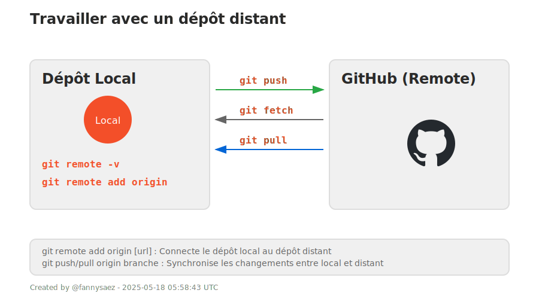

## 4. Travailler avec un dépôt distant (ex : GitHub)

| Commande | Description |
|----------|-------------|
| `git remote -v` | Liste les dépôts distants (pour voir si ton projet est lié à GitHub). |
| `git remote add origin [url]` | Connecte ton dépôt local à un dépôt distant. |
| `git push origin branche` | Envoie ton code vers le dépôt distant. |
| `git pull origin branche` | Récupère et fusionne les modifs du dépôt distant. |
| `git fetch origin` | Récupère les modifs du dépôt sans les fusionner automatiquement. |

---

  

---

<a href="./branches.md">Précédent</a> 
| <a href="./historique.md">Suivant</a>

