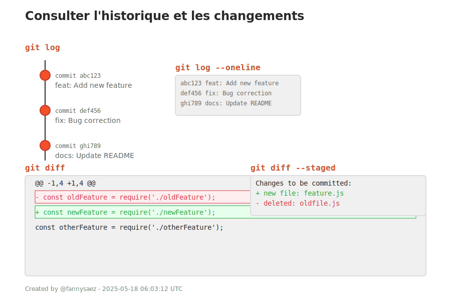

## 5. Consulter l'historique et les changements

| Commande | Description |
|----------|-------------|
| `git log` | Liste tous les commits effectués. |
| `git log --oneline` | Affiche les commits en version compacte. |
| `git diff` | Montre les différences non ajoutées (entre fichier modifié et version enregistrée). |
| `git diff --staged` | Montre les différences déjà ajoutées (en attente de commit). |

---

  

---

<a href="./depot-distant.md">Précédent</a> 
| <a href="./modifs-necessaires.md">Suivant</a>

