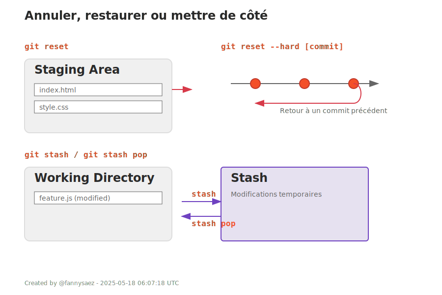

## 6. Annuler, restaurer ou mettre de côté

| Commande | Description |
|----------|-------------|
| `git reset fichier` | Enlève un fichier de la staging area (mais garde les modifs). |
| `git reset --hard [commit]` | Repart sur un ancien commit et supprime tout ce qu'il y a après. |
| `git stash` | Sauvegarde temporairement les modifs en cours (pour changer de branche sans perdre). |
| `git stash pop` | Récupère les modifications mises de côté. |

---

  

---

<a href="./historique.md">Précédent</a> 
| <a href="./plus-loin.md">Suivant</a>

