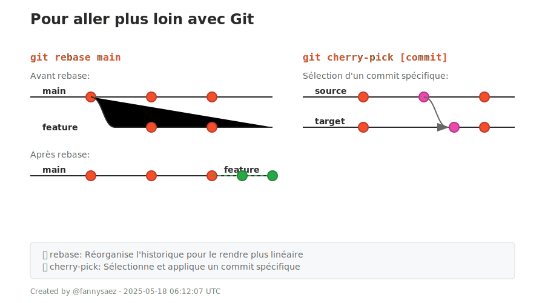

## 7. Pour aller plus loin

| Commande | Description |
|----------|-------------|
| `git rebase branche` | Rejoue les commits d'une branche sur une autre, pour un historique plus propre. |
| `git cherry-pick [commit]` | Applique un commit précis sur ta branche actuelle (sans tout fusionner). |

---

  

---

<a href="./modifs-necessaires.md">Précédent</a> 
|
<a href="../README.md">Retour</a>

