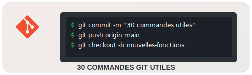

<div align="center">
  
  
  # 30 commandes Git Utiles
  *Un guide détaillé pour maîtriser Git de zéro*

[](https://git-scm.com/)
[](https://git-scm.com/)
[](https://git-scm.com/)

</div>

> Quand on commence à utiliser Git, on se limite souvent à git add, git commit, et git push...
> Mais Git propose bien plus pour suivre, tester, corriger ou organiser son travail au quotidien.


Voici une sélection de 30 commandes que je trouve pratiques :
<div align="center">
  
</div>

## 📋 Table des matières

- [1. Démarrer avec Git](#1-démarrer-avec-git)
- [2. Suivre les changements](#2-suivre-les-changements)
- [3. Travailler avec des branches](#3-travailler-avec-des-branches)
- [4. Travailler avec un dépôt distant](#4-travailler-avec-un-dépôt-distant-ex--github)
- [5. Consulter l'historique et les changements](#5-consulter-lhistorique-et-les-changements)
- [6. Annuler, restaurer ou mettre de côté](#6-annuler-restaurer-ou-mettre-de-côté)
- [7. Pour aller plus loin](#7-pour-aller-plus-loin)

---

### 🗂️ Structure des 30 commandes Git

```bash
📂 Guide-Cmd-Git
│── 📄 README.md            --> Page d'accueil avec introduction et table des matières
│── 📂 Cmd-Git              --> Dossier pour les commandes Git
│   ├── 📄 demarrer-Git.md       --> Démarrer avec Git (Section 1)
│   ├── 📄 modifs-necessaires.md --> Suivre les changements (Section 2)
│   ├── 📄 branches.md           --> Travailler avec des branches (Section 3)
│   ├── 📄 depot-distant.md      --> Travailler avec un dépôt distant (Section 4)
│   ├── 📄 historique.md         --> Consulter l'historique et les changements (Section 5)
│   ├── 📄 changements.md        --> Annuler, restaurer ou mettre de côté (Section 6)
│   ├── 📄 plus-loin.md          --> Pour aller plus loin (Section 7)
│── 📂 assets               --> Dossier pour les ressources
│   ├── 🖼️ branch-example.png    --> Illustration du branching
│   ├── 🖼️ git-workflow.png      --> Schéma du workflow Git
│   ├── 🖼️ merge-vs-rebase.png   --> Comparaison merge/rebase
│   └── 📂 svg                 --> Sous-dossier pour les icônes SVG
│       ├── 📄 advanced-git.svg
│       ├── 📄 getting-started.svg
│       ├── 📄 git-commands-logo.svg
│       ├── 📄 git-operations.svg
│       ├── 📄 gitcommands-logo.svg
│       ├── 📄 history-and-changes.svg
│       ├── 📄 Licence-MIT-blue.svg
│       ├── 📄 remote-repository.svg
│       ├── 📄 reset-and-stash.svg
│       ├── 📄 tracking-changes.svg
│       └── 📄 working-with-branches.svg
```

---

<div align="center">
  
## 💡 Astuces supplémentaires

</div>

- Crée des **alias Git** pour accélérer tes commandes fréquentes:
  ```bash
  git config --global alias.co checkout
  git config --global alias.br branch
  git config --global alias.ci commit
  git config --global alias.st status
  ```

<!-- - Utilise un **outil graphique** comme GitKraken, SourceTree ou l'intégration Git de ton IDE pour visualiser plus facilement les branches.

- Envisage d'utiliser un fichier `.gitignore` pour exclure automatiquement certains fichiers du versionnement (logs, fichiers de config, dossiers de dépendances...). -->

---

<div align="center">
  
*Enregistre ce fichier comme mémo personnel ou partage-le avec ton équipe pour vous aider à mieux exploiter Git !*

[](LICENSE)

---

</div>
<p align="center">
  <a href="Cmd-Git/demarrer-Git.md">Suivant</a>
</p>
